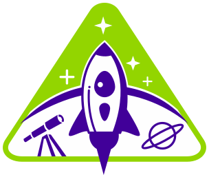

[Home](README.md) | [Cast](Cast.md) | [Collectibles](Collectibles.md)



# **StarGazers** Unleashed the {{myvar}}

The Stargazers are members of the _Intergalactic Alliance_ paving the way for peace and benevolence among all species. They are known for their enthusiasm for science, for their love of fun, and their dedication to education.

# Communication

Stargazers are fluent in **JavaScript**, so once you connect to their network, simply type in a message into their console.

```js
console.log("Take me to your leader");
```

# Disclaimer

Stargazers Aliens is a fictitious company created by <a href="https://www.linkedin.com/">LinkedIn Corporation</a>, or its affiliates, solely for the creation and development of <a class="text-secondary" href="https://www.linkedin.com/learning/">educational training</a> materials. Any resemblance to real products or services is purely coincidental. Information provided about the products or services is also fictitious and should not be construed as representative of actual products or services on the market in a similar product or service category.
